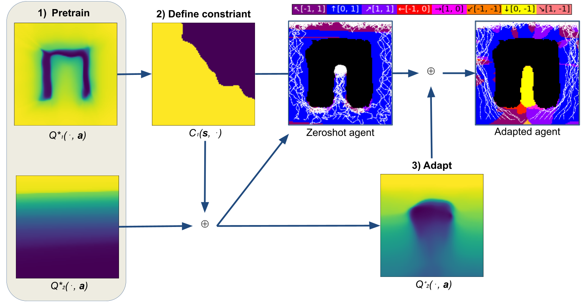
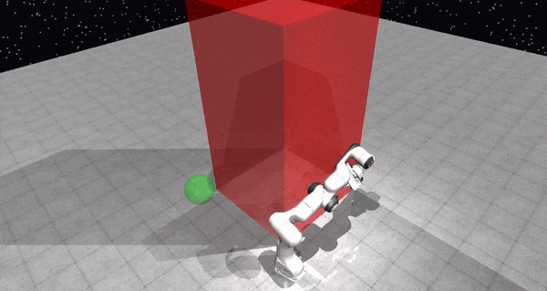
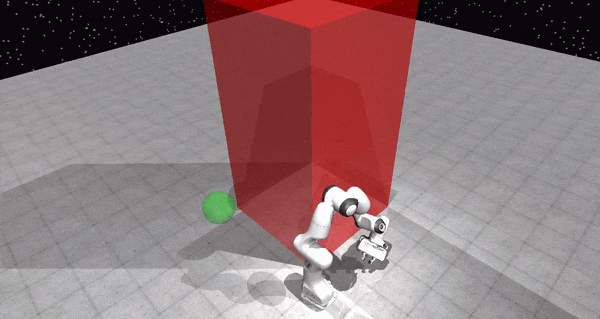

# PSQD
This is the code repository for our 2024 ICLR paper "Prioritized Soft Q-Decomposition for Lexicographic Reinforcement Learning".

### PSQD learning algorithm (2D example):


### High dimensional Franka Emika Panda joint control experiment:
<table>
<tr>
<td>
<span>Unconstrained baseline fails at avoiding the red area due to poor reward scale / regularization coefficcients:</span>
<figure>

<p>SQL (unconstrained)</p>
</figure>
</td>
<td>
<span>PSQD respects the constraints even in thezeroshot setting, without additional training:</span>
<figure style="float:left;">

<p>PSQD (zeroshot)</p>
</figure>
</td>
<td>
<span>PSQD learns to adapt to the constraint, then solving the constrained task optimally:</span>
<figure>

<p>PSQD (adapted)</p>
</figure>
</td>
</tr>
</table>


## Installation
Our implementation is based on PyTorch. Install the version of PyTorch that is appropriate for your system from [here](https://pytorch.org/get-started/locally/). 
We used PyTorch 1.13.1 with CUDA 11.6.

If you want to train on or view the Franke Emika Panda Mujoco environment, install the mujoco simulator from [here](https://mujoco.org/), as well as the official Python bindings from [here](https://pypi.org/project/mujoco/).
Running scripts that use Mujoco requires that the `LD_LIBRARY_PATH` environment variable is set to the path of the mujoco binaries. Adjust the paths below and run:
```bash
export LD_LIBRARY_PATH=/home/finn/.mujoco/mujoco210/bin:/usr/lib/nvidia
```

Install the remaining requirements as usual:
```bash
git clone https://github.com/frietz58/psqd
cd psqd
# optionally make venv
pip install -r requirements.txt
```

## Usage
We provide model checkpoints that can be used to reproduce the results from the paper.
To view the trained Panda agent, simply run:
```bash
cd examples/
python3 view_panda_agent.py
```
This script loads a high-priority (obstacle avoidance) agent and the adapted/fine-tuned agent for reaching the end-effector position.

Similarly, an agent for the 2D point navigation environment can be viewed by running:
```bash
cd examples/
python3 view_point_agent.py
```
The script loads a pre-trained obstacle-avoidance agent, an adapted top-reach agent, and a adapted side-reach agent.
The scripts performs 10 rollouts starting a varying initial positions and plots the resulting trajectories.
Furhtermore, the script creates a folder in `examples/` and plots the Q-functions and constraints/indifferent spaces of all agents.

## Training agents
All our results can be reproduced using the `train_psqd.py` script, depending on the parameterization, the script can be 
used to pre-train agents or, by providing a list of priority constraints, to adapt agents to a given taks-priority order.
The main code of our learning algorithm (PSQD) is implemented in `algos/psqd.py`. 
Concrete examples for how to train PSQD and reproduce our results can be found in the `examples/` folder.

### Point navigation
As described in the paper, our method first pre-trains a high-priority agent, then trains lower-priority agents that 
are constrained to the indifference-space of all higher-priority agents. The lower-priority agents can be 
pre-trained and subsequently adapted or directly trained given the high-priority agent.

Due to the low dimensionality of the point navigation environment, we rely on importance sampling to generate 
action samples form the policy instead of training a sampling network with ASVGD.

An exemplary script for pre-training SQL agents with importance sampling on the point navigation environment is given in
`examples/pretrain_point_agent.py`. The adaptation procedure is implemented in `examples/adapt_point_agent.py`. 
1. Pre-train agents for all tasks:
```bash
cd examples/
python3 pretrain_point_agent.py --task obstacle
python3 pretrain_point_agent.py --task top_reach
python3 pretrain_point_agent.py --task side_reach
```
2. Depending on your priority order of choice, adapt either the `side_reach` or `top_reach` agent to the obstacle avoidance task, e.g.:
```bash
cd examples/
python3 adapt_point_agent.py \
  --task top_reach \
  --pretrained "../runs/SQL_ImportanceSampling_PointNavEnv_TopReach_Constraints:[]_2023-06-22_17:13:36" \
  --constraints "../runs/SQL_ImportanceSampling_PointNavEnv_Obstacle_Constraints:[]_2023-06-22_17:13:21" \
  --thresholds 1
```
3. Adapt the remaining agent to given the two higher-priority agents, e.g.:
```bash
cd examples/
python3 adapt_point_agent.py \
  --task top_reach \
  --pretrained "../runs/SQL_ImportanceSampling_PointNavEnv_SideReach_Constraints:[]_2023-06-22_17:13:40" \
  --constraints "../runs/SQL_ImportanceSampling_PointNavEnv_Obstacle_Constraints:[]_2023-06-22_17:13:21" "../runs/SQL_ImportanceSampling_PointNavEnv_TopReach_Constraints:[Obstacle]_2023-06-26_13:52:42" \
  --constraint_eps 1500 1500 \
  --thresholds 1 1
```

Sidenote: We found that `tanh` non-linearities give nicer looking Q-functions, while `relu` non-linearities tend to produce artifacts
in the Q-function. We therefore use `tanh` non-linearities in all our experiments, althought this is suboptimal from the gradients/backprop perspective.

### Franka Panda
In the high-dimensional Franka Emika Panda environment, we rely on ASVGD to generate action samples from the policy, 
since importance sampling in high-dimensional spaces suffers from the curse of dimensionality.
Unfortunately, soft Q-learning with the ASVGD sampling network is very brittle and requires careful hyperparameter tuning.
Our scripts contain hyperparameters that worked well for this environment, but they likely must be tuned for other environments.
We found that the number of particles, batch size, and learning rate for the sampling network optimizer are the most important hyperparameters.

Apart from that, the steps for running PSQD are unchanged.
1. Pre-train agents for all tasks:
```bash
cd examples/
python3 pretrain_panda_agent.py --task avoid
python3 pretrain_panda_agent.py --task reach
```
2. Adapt the `reach` agent to the `avoid` constraint:
```bash
   python3 adapt_panda_agent.py \
   --task reach \
   --pretrained "../runs/SQL_AmortizedStein_PandaEnv_Reach_Constraints:[]_2023-07-07_17:05:44reproduce" \
   --constraints "../runs/SQL_AmortizedStein_PandaEnv_Avoid_Constraints:[]_2023-07-07_17:06:00reproduce" \
   --constraint_eps 400 \
   --thresholds 1
```
